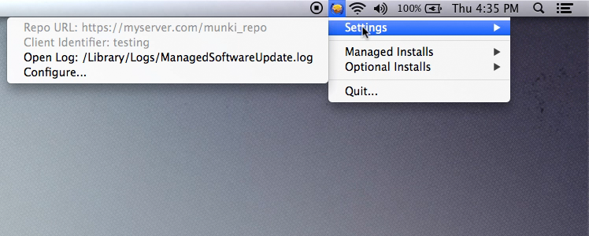
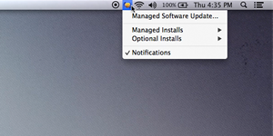
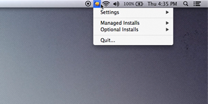
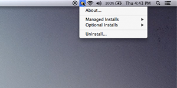
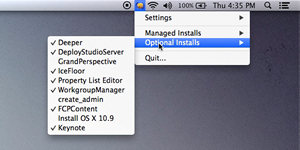
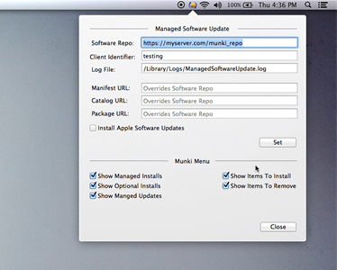

## Introduction
MunkiMenu makes Managed Software Update easily accessible.  It lives in the status bar and is a wrapper for the "Managed Software Update.app" in the Utilities folder. 

When pressing the command key It also shows some at a glance information that is useful to administrators when trying to diagnose client misconfiguration. This will also display the "Quit..." menu item.  Press the option key for the "Uninstall..." menu item.

As of version 0.3.0 the selecting an optional install item will either install or uninstall that item.

  

####[Visit the Release Page to download the current version][releases]
#### For instructions on how to install with Munki see the [install page][install_with_munki]

#### [Building From Source][tech_notes] and other tech notes  

Please report any issues or feature requests.  Pull requests are also welcome and always considered.

Screen Shots  
---
  

 Command Key Pressed  

 Option Key Pressed  

 List of Optional Installs   

 Configuration Menu  

[default]:./docs/screen_shots/MMScreen-Default.png
[commandKey]:./docs/screen_shots/MMScreen-Command-Key.png
[optionKey]:./docs/screen_shots/MMScreen-Option-Key.png
[configPopup]:./docs/screen_shots/MMScreen-Config.png.png

[releases]:https://github.com/eahrold/MunkiMenu/releases
[tech_notes]:./docs/technotes.md
[install_with_munki]:./docs/installing_with_munki.md